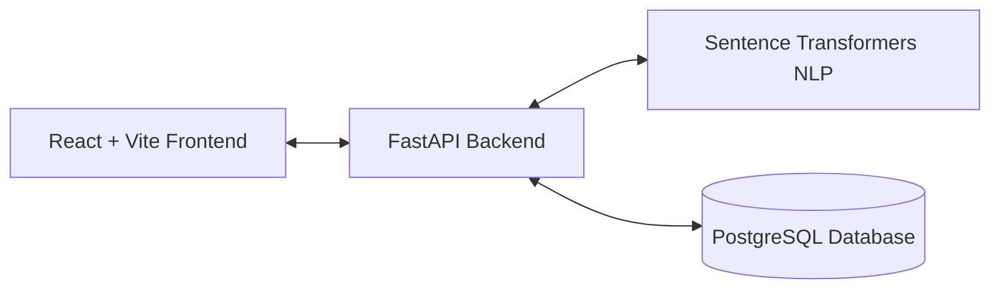

# AI Resume Screening & Job Matching System

A production-quality full-stack application that leverages Artificial Intelligence and Natural Language Processing (NLP) to semantically match candidate resumes against job descriptions. This system helps recruiters automatically rank candidates based on their technical skills, experience, and the overall semantic similarity of their resume to the job posting.

## Features

*   **Role-Based Access Control (RBAC)**: Distinct dashboards for Candidates and Recruiters.
*   **Intelligent Resume Parsing**: Extracts candidate information, education, experience, and skills from uploaded PDFs and DOCX files.
*   **Semantic AI Matching**: Uses `SentenceTransformers` (`all-MiniLM-L6-v2`) to generate embeddings and compute cosine similarity beyond basic keyword matching.
*   **Weighted Scoring Algorithm**: Generates a final Match Score using Semantic Similarity (40%), Skill Match (30%), Experience Match (15%), Education Match (10%), and Preferred Skills (5%).
*   **Explainable AI**: Provides recruiters with a detailed breakdown of the Match Score (matched skills vs missing skills).
*   **FastAPI Backend**: High-performance asynchronous backend with SQLAlchemy ORM and PostgreSQL.
*   **React + Vite Frontend**: Responsive, modern, and professional UI built with Tailwind CSS.

## Architecture



## AI Methodology

1.  **Text Extraction & Cleaning**: Resumes and Job Descriptions are parsed using PyMuPDF / pdfplumber / python-docx.
2.  **Embeddings**: Processed text is passed through the `all-MiniLM-L6-v2` transformer model to generate dense vector embeddings.
3.  **Cosine Similarity**: The distance between the Resume Embedding and Job Description Embedding is computed.
4.  **Information Extraction**: Specialized rule-based extraction detects technical skills against a known taxonomy.
5.  **Weighted Matching**: The final candidate score is a weighted combination of multiple metrics (Semantic + Skills).

## Installation

### Prerequisites

*   Python 3.11+
*   Node.js 18+
*   PostgreSQL running locally or in Docker

### 1. Database Setup

Create a PostgreSQL database named `resume_screening`.

### 2. Backend Setup

```bash
cd backend
python -m venv venv
venv\Scripts\activate  # Windows
# source venv/bin/activate  # Mac/Linux

pip install -r requirements.txt

# Copy env file
cp .env.example .env

# Seed initial database and create tables
python seed_data.py

# Run development server
uvicorn app.main:app --reload
```

### 3. Frontend Setup

```bash
cd frontend
npm install
npm run dev
```

## API Documentation

FastAPI provides automatic interactive API documentation:
*   Swagger UI: http://localhost:8000/docs
*   ReDoc: http://localhost:8000/redoc

## Future Improvements

*   **LLM Integration**: Use generative LLMs to write tailored rejection or acceptance emails.
*   **Vector Database**: Migrate from simple Cosine Similarity to a dedicated Vector DB (like Pinecone or Qdrant) for millions of candidates.
*   **Advanced Analytics**: Provide recruiters with hiring funnel analytics.
